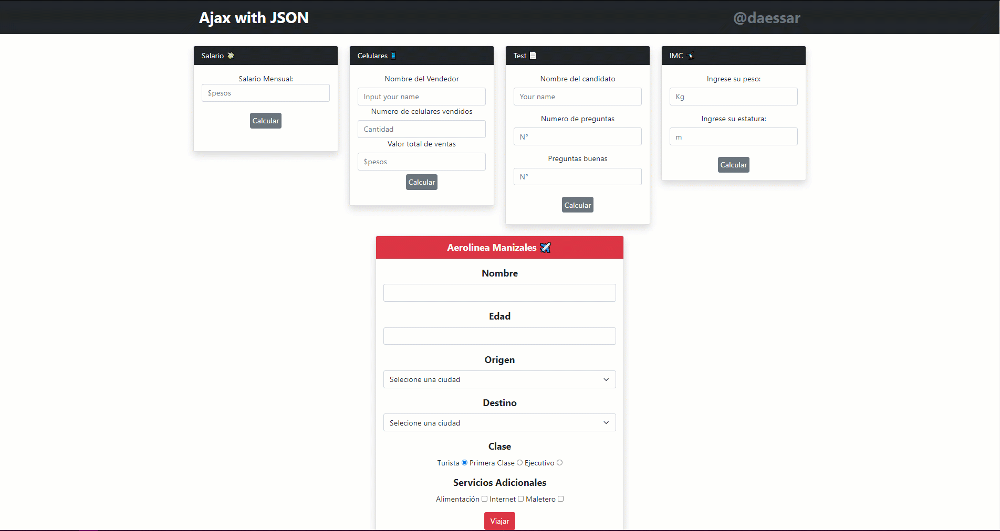

# Mostrando resultados sin recargar la página

Este estos son una serie de ejercicios los cuales no requieren recargar la pagina para mostrar el resultado una vez ejecutado el formulario.

## Tecnologías utilizadas

- HTML
- Javascript
- PHP
- Ajax
- JSON
- Boostrap

Funcionamiento

